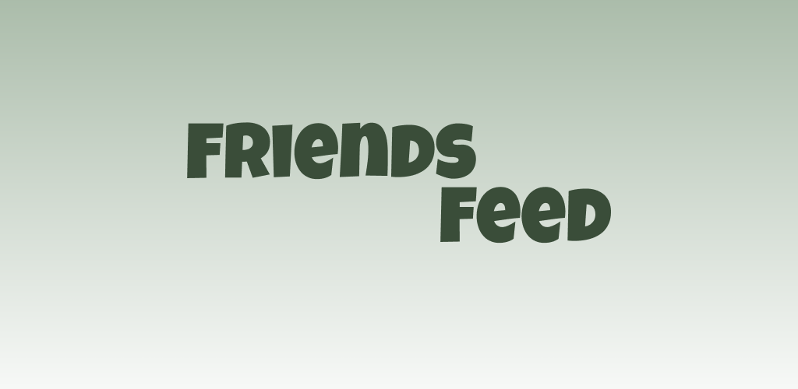

## Friends Feed

Introducing Friends Feed, the ultimate social media app for foodies and culinary enthusiasts! Connect with your friends, family, and favorite food bloggers to discover their favorite dining spots in your area. Whether you're a seasoned food critic or just someone who loves a good meal, Friends Feed is your go-to platform for sharing and discovering the best restaurants around. You can check out the live project [here](https://friendsfeed.netlify.app).

## Key Features:
- 🍽 **Follow Your Foodie Circle** Stay connected with friends, family, and top food bloggers to see their latest culinary adventures. Discover hidden gems, get real-time updates on what and where to eat.
- 📍 **Local Recommendations** Explore a curated feed of restaurant recommendations tailored to your location and opinions you trust. Friends Feed makes it easy to find the perfect spot for any occasion, whether it's a cozy brunch spot, a trendy dinner spot, or for late-night cravings.
- 📸 **Foodie Moments** Share your own foodie experiences, with a social media app purely dedicated to food! No need to search through various platforms on your next food adventure.
- 🌟**Personalizd Feed: Customize your feed based on your preferences. Follow specific cuisines, dietary preferences, or favorite food bloggers to tailor your Friends Feed experience to your unique taste.
- 🤝 **Community Engagement** Engage with the Friends Feed community to exchange tips, recipes, and restaurant reviews. Your input helps others discover their next favorite meal.
- 🔍 **Explore New Cuisines**  Expand your culinary horizons by discovering new restaurants and cuisines recommended by your foodie network. Friends Feed is your passport to a world of flavors right at your fingertips.

## Tech Stack
- React
- Flask
- PostgreSQL

